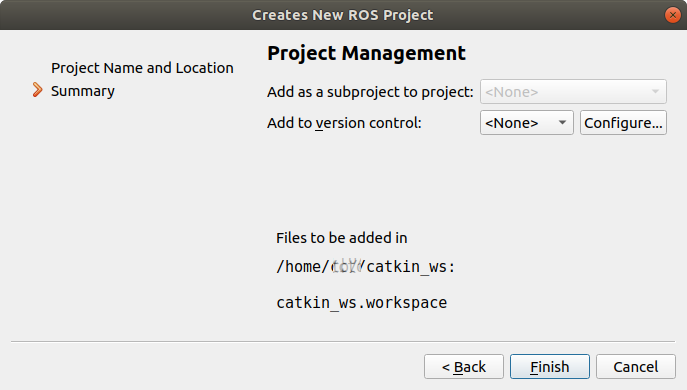
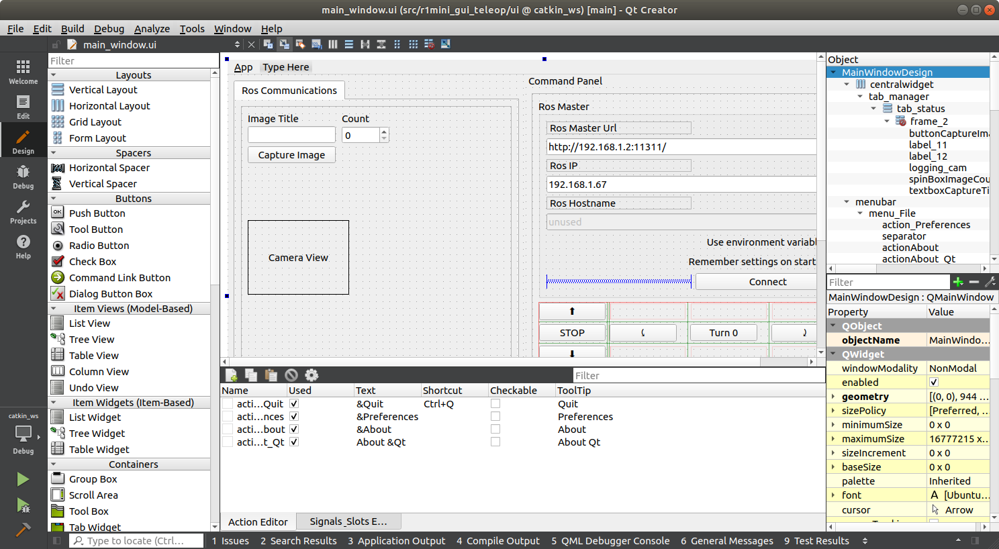
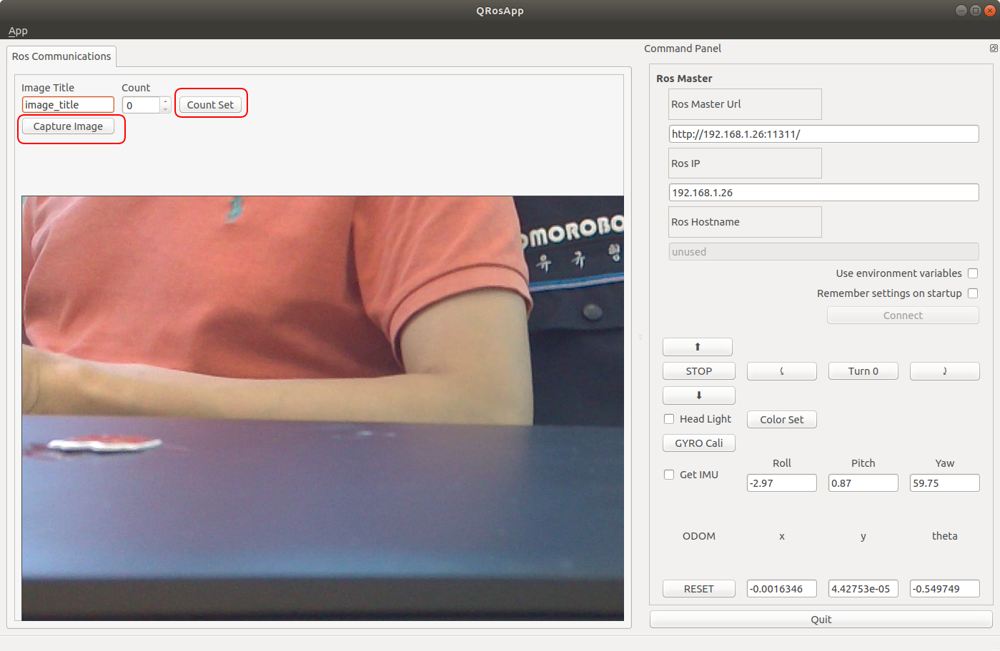
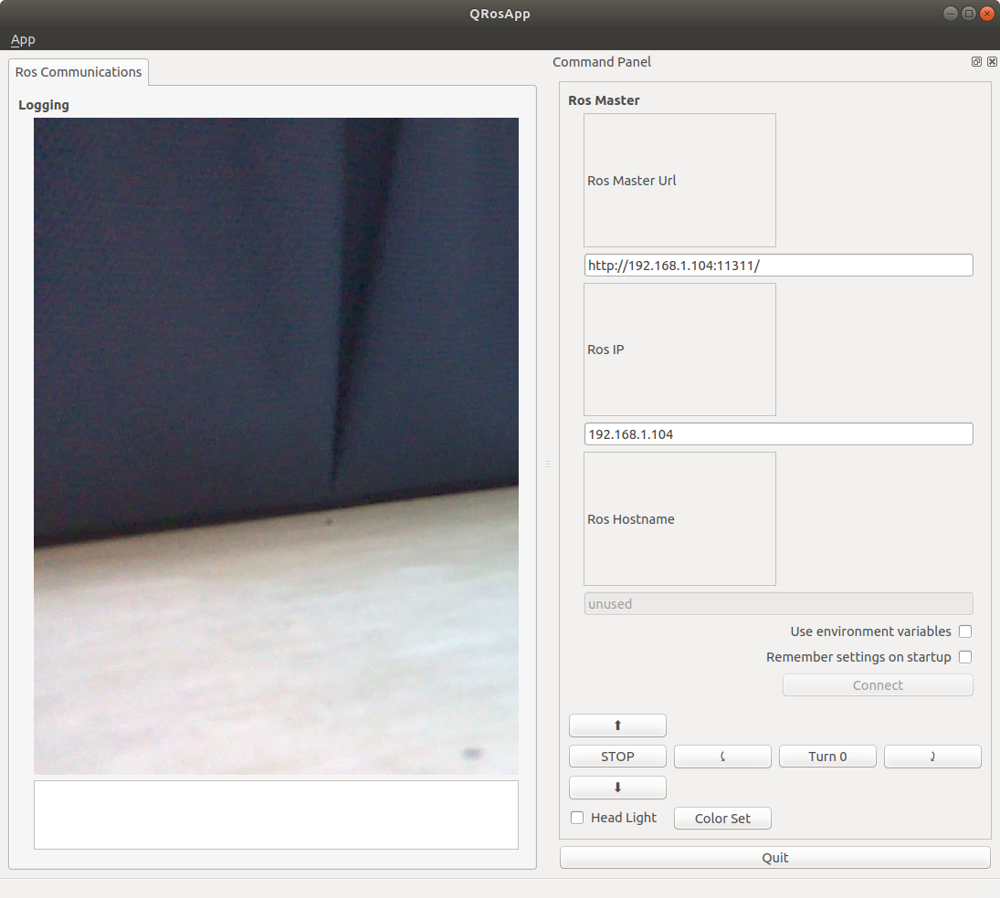

# r1mini_gui_teleop

## Description

For Korean, **한국어**[문서](README_KR.md)  
This project is about demonstrating how to implement GUI based controller for R1mini robot.
With this project you can  

- Control R1mini robot  
- Monitor sensor data  
- Check battery status  
- Change LED color  
- Turn On/Off head light  
- Capture image from camera attached to Jetson nano  

## Setup for coding with QT-creator-ROS

### QT-creator installation

If you don't want to change the UI panel, skip this part and move to install additional packages.

Follow instruction below to install ROS-QT.
https://ros-qtc-plugin.readthedocs.io/en/latest/_source/How-to-Install-Users.html

### Setup catkin workspace for QT-creator-ROS

Open QT-creator and go to File > New FIle and Project and select **Other Project** 
Choose ROS Workspace  
  

Set Project Name and Location as below.
Set Distribution per your ROS version and Build System is CatkinMake
Workspace Path should be the same as what you named for your root of catkin workspace.

  

Leave blank for version control and Finish.  
  

Now you will see the project similar to below image.  
  

Find the main_window.ui and you will see QT-designer.  
  

## Install Additional packages

Following additional packages maybe required to build this package.

```
$ sudo apt install -y libqt4-dev ros-melodic-qt-build ros-melodic-qt-gui libqt4-dev
$ sudo apt install ros-melodic-qt-gui-app
```

## catkin make

If your catkin workspace is /catkin_ws under /home folder, cd to the src folder
```
$ cd ~/catkin_ws/src
```
Then git clone this source
```
$ git clone <this source link>
```
Back to the /cakin_ws folder and try catkin_make from there.
```
$ catkin_make
```

## Usage

Launch this package by entering below command with roscore running

```
$ rosrun r1mini_gui_teleop r1mini_gui_teleop
```

Run the r1mini robot and camera simulatneously by entering below command in ssh terminal to robot
```
$ roslaunch omo_r1mini_bringup omo_r1mini_robot_camera.launch
```

Finally you will see the camera image as well as robot's omdometry data as below

  

You can enter the name of image and count which will be saved as "image_titile_0.jpg", "image_title_1.jpg" and so on upon pressing the capture button.

This feature is convenient for training images for AI networks like YOLO.  

## Trouble shooting

### Parse error at "BOOST_JOIN"

If error like this happens, refer to below document.
https://answers.ros.org/question/233786/parse-error-at-boost_join/

Edit has_binary_operator.hpp by

```
$ sudo gedit /usr/include/boost/type_traits/detail/has_binary_operator.hpp
```

And try to find code below

```
namespace BOOST_JOIN(BOOST_TT_TRAIT_NAME,_impl) {
...
}
```
And change as 
```
#ifndef Q_MOC_RUN
namespace BOOST_JOIN(BOOST_TT_TRAIT_NAME,_impl) {
#endif

....

#ifndef Q_MOC_RUN
}
#endif

```

### Error with cv_bridge

$ sudo nano /opt/ros/melodic/share/cv_bridge/cmake/cv_bridgeConfig.cmake

Change /usr/include/opencv to /usr/**local**/include/opencv

```
if(NOT "include;/usr/include;/usr/include/opencv " STREQUAL " ")
  set(cv_bridge_INCLUDE_DIRS "")
  set(_include_dirs "include;/usr/include;/usr/local/include/opencv")
  if(NOT "https://github.com/ros-perception/vision_opencv/issues " STREQUAL " ")
    set(_report "Check the issue tracker 'https://github.com/ros-perception/vis$
  elseif(NOT "http://www.ros.org/wiki/cv_bridge " STREQUAL " ")
    set(_report "Check the website 'http://www.ros.org/wiki/cv_bridge' for info$
  else()
```

If there is no error, you can run this project by
```
$ rosrun r1mini_gui_teleop r1mini_gui_teleop
```
Don't forget to run roscore before run any ROS packages.
And you will see below window.



Enjoy!

Project r1mini_gui_teleop written by Kyuhyong
2021(c)OMOROBOT INC.
