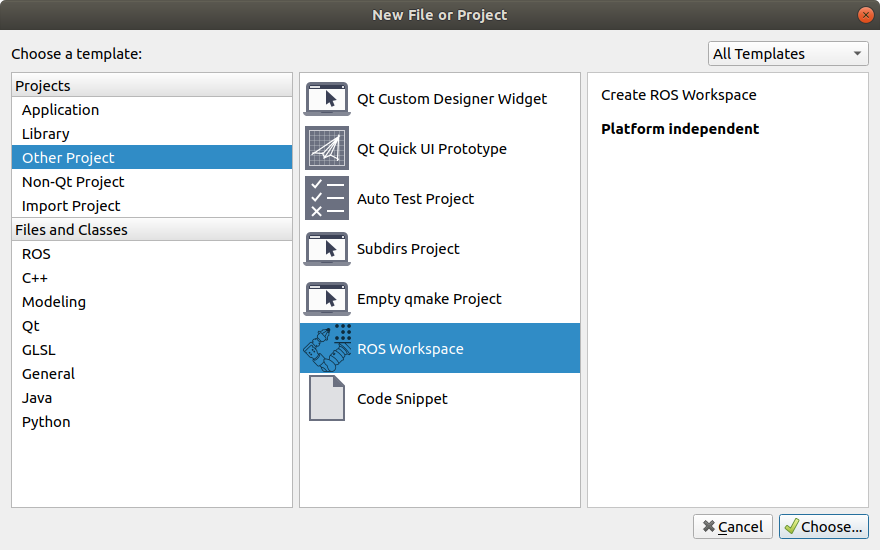
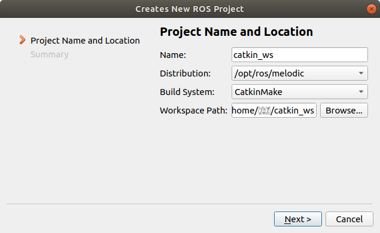
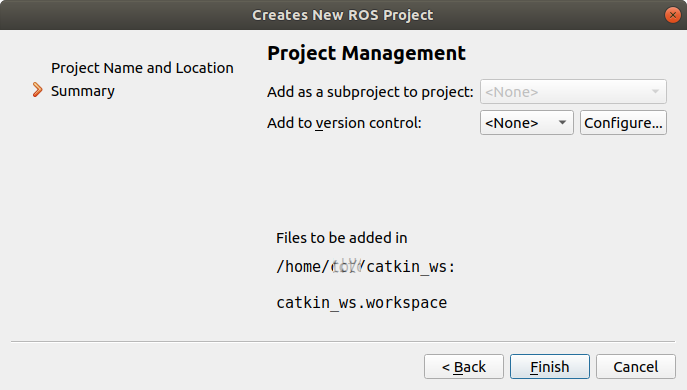
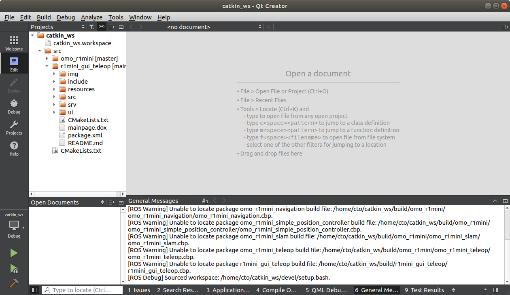
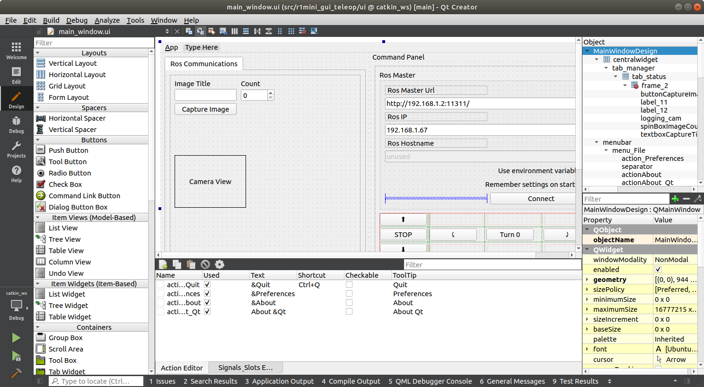
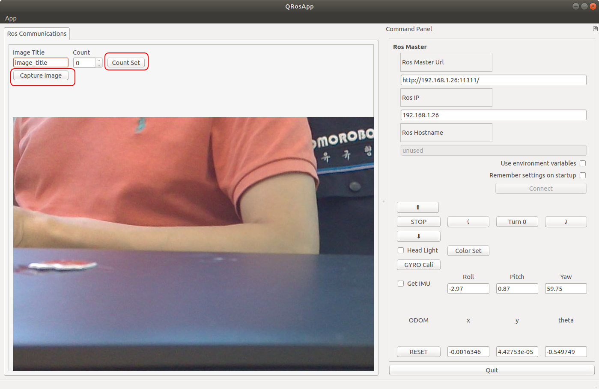
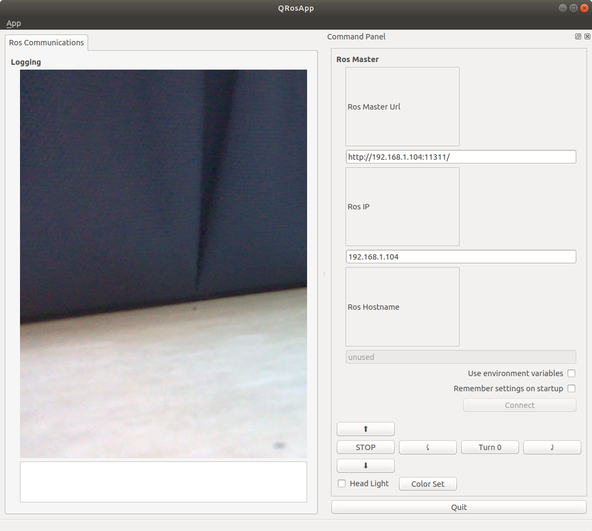

# r1mini_gui_teleop

## Description

이 프로젝트는 ROS에서 R1mini 로봇의 GUI 인터페이스를 제공합니다.  
Ubuntu 18.04에서 ROS-melodic 이 설치된 환경에서 구현되었습니다.  
이 프로그램은 Qt Creator 4.9.2 에서 작성되었습니다.  
R1mini Pro 로봇이 필요합니다. 


## QT-creator-ROS 에서 코드 수정하는 방법

### QT-creator 설치

UI 패널을 변경할 필요가 없다면 이부분을 건너뛰고 추가 패키지 설치로 진행하고 catkin_make 또는 catkin build 명령으로 패키지를 설치할 수 있습니다.  

아래 페이지를 따라 ROS-QT를 설치하십시오.
https://ros-qtc-plugin.readthedocs.io/en/latest/_source/How-to-Install-Users.html

### QT-creator-ROS 에서 catkin 워크스페이스 열기

QT-creator를 열고 File > New FIle and Project 를 선택한 후 **Other Project** 를 클릭하여 ROS 워크스페이스를 선택합니다.

  

다음과 같이 Name과 Location을 설정합니다.
Distribution은 설치된 ROS 버전으로 선택하고 Build System을 CatkinMake로 선택합니다.
워크스페이스 경로는 catkin 워크스페이스의 root와 동일하게 설정합니다.  

   

version control은 비워둔채로 놓고 Finish를 눌러 끝냅니다.  

  
  
이제 프로젝트가 아래 그림처럼 보일 것입니다.  
  

main_window.ui를 선택하면 QT-designer에서 GUI를 편집할 수 있습니다.  
  

## 추가 패키지 설치

ROS-QT를 설치하지 않은 경우 다음의 추가 패키지를 설치하여 catkin_make 명령으로 프로젝트를 설치할 수 있습니다.

```
$ sudo apt install -y libqt4-dev ros-melodic-qt-build ros-melodic-qt-gui libqt4-dev
$ sudo apt install ros-melodic-qt-gui-app
```

## catkin make

워크스페이스 폴더의 src 폴더로 이동합니다. (/catkin_ws가 /home 폴더 아래에 있는경우)
```
$ cd ~/catkin_ws/src
```
이 프로젝트를 git clone 하여 복사합니다.
```
$ git clone <this source link>
```
/cakin_ws 로 돌아간 다음 catkin_make 또는 catkin build로 설치합니다.
```
$ cd ..
$ catkin_make
```

## 사용방법

roscore를 실행한 상태에서 다음 명령어를 입력하여 실행합니다.

```
$ rosrun r1mini_gui_teleop r1mini_gui_teleop
```
https://github.com/omorobot/omo_r1mini 가 설치된 R1mini 로봇에 ssh 접근 후 다음을 입력하여 robot과 camera를 실행합니다.
```
$ roslaunch omo_r1mini_bringup omo_r1mini_robot_camera.launch
```

드디어 GUI 환경을 통해 로봇의 카메라로부터 들어온 이미지와 로봇의 각종 정보를 확인할 수 있습니다.

  

Image Title에 저장할 이미지의 이름을 입력하고 Capture Image버튼을 누르면 "<이미지 이름>_<Count>.jpg" 형식으로 파일이 저장됩니다.
만약 Count 숫자를 변경하고자 하는경우 count set 버튼을 누르면 됩니다.

이 기능은 YOLO나 CNN 등에 사용할 이미지를 분류하는데 유용합니다.

## 문제 해결

### "BOOST_JOIN" 파싱 에러

BOOST_JOIN 관련 에러가 발생하는 경우 아래 문서를 참조하여 문제를 해결합니다.  

https://answers.ros.org/question/233786/parse-error-at-boost_join/

/usr/include/boost/type_traits/detail 폴더 안의 has_binary_operator.hpp 파일을 열고

```
$ sudo gedit /usr/include/boost/type_traits/detail/has_binary_operator.hpp
```

다음 항목을 찾은다음

```
namespace BOOST_JOIN(BOOST_TT_TRAIT_NAME,_impl) {
...
}
```

아래와 같이 수정합니다.

```
#ifndef Q_MOC_RUN
namespace BOOST_JOIN(BOOST_TT_TRAIT_NAME,_impl) {
#endif

....

#ifndef Q_MOC_RUN
}
#endif

```

### cv_bridge 에러

cv_bridgeConfig.cmake 파일을 편집하기 위해 연 다음,

$ sudo nano /opt/ros/melodic/share/cv_bridge/cmake/cv_bridgeConfig.cmake

/usr/include/opencv 항목을 찾아 /usr/**local**/include/opencv 로 변경합니다.

```
if(NOT "include;/usr/include;/usr/include/opencv " STREQUAL " ")
  set(cv_bridge_INCLUDE_DIRS "")
  set(_include_dirs "include;/usr/include;/usr/local/include/opencv")
  if(NOT "https://github.com/ros-perception/vision_opencv/issues " STREQUAL " ")
    set(_report "Check the issue tracker 'https://github.com/ros-perception/vis$
  elseif(NOT "http://www.ros.org/wiki/cv_bridge " STREQUAL " ")
    set(_report "Check the website 'http://www.ros.org/wiki/cv_bridge' for info$
  else()
```

아무런 문제가 없으면 다음과 같이 입력하여 실행합니다.  

```
$ rosrun r1mini_gui_teleop r1mini_gui_teleop
```

Don't forget to run roscore before run any ROS packages.
And you will see below window.



Enjoy!

Project r1mini_gui_teleop written by Kyuhyong
2021(c)OMOROBOT INC.
